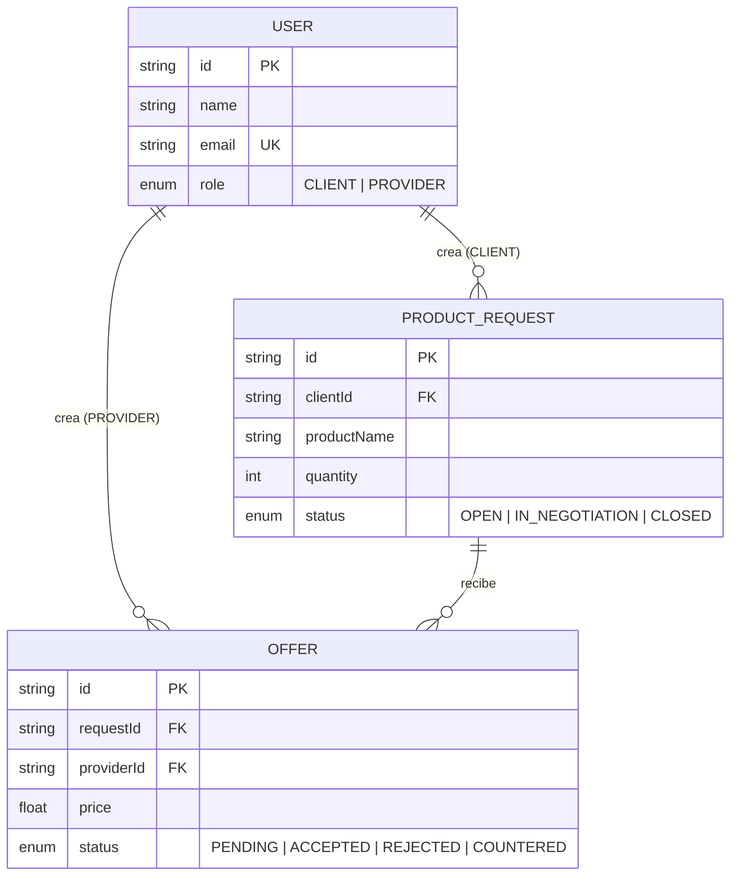
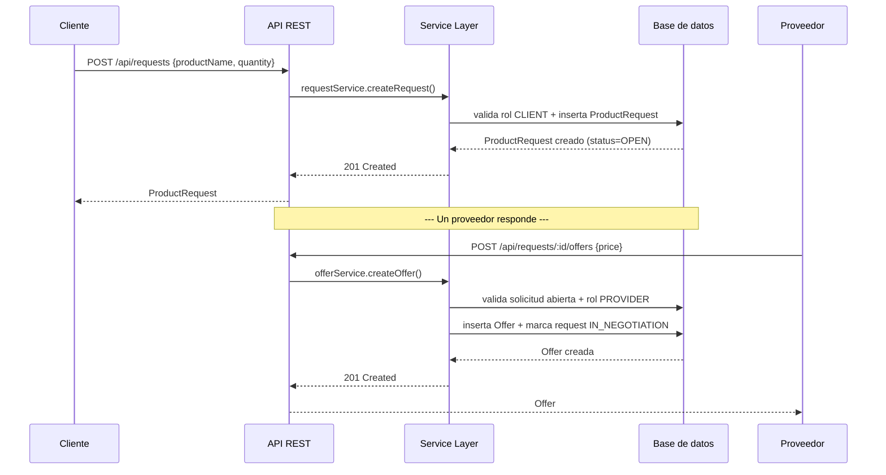

# Arquitectura del Sistema

## 1. Vision general

El sistema se disenya como una **API REST monolitica modular**, organizada por
dominio (feature-based), con separacion estricta de capas dentro de cada
modulo. Es la opcion correcta para el alcance de esta prueba: un monolito
bien modularizado se implementa y se revisa en el tiempo estimado (1-2 horas),
y al estar dividido por dominio (no por capa tecnica global), migrar un
modulo a un microservicio en el futuro es un ejercicio de "extraer carpeta",
no de reescribir la logica de negocio.

## 2. Los tres modulos principales

```
┌───────────────────────────────────────────────────────────────────┐
│                            API REST (Express)                       │
├─────────────────────┬──────────────────────┬────────────────────────┤
│ Modulo: Solicitudes  │ Modulo: Ofertas       │ Modulo: Decisiones      │
│ de Productos         │ de Proveedores        │ del Cliente              │
│ (implementado)       │ (implementado)        │ (disenyado, fuera de     │
│                       │                        │  alcance de codigo)      │
│ - Cliente crea        │ - Proveedor responde   │ - Cliente acepta/        │
│   solicitud           │   con precio            │   rechaza/contraoferta  │
│ - Consulta de         │ - Ligada a una          │ - Cambia el status de   │
│   solicitudes         │   solicitud existente   │   la Offer y de la      │
│                       │                        │   ProductRequest         │
└─────────────────────┴──────────────────────┴────────────────────────┘
                 │                    │                     │
                 └──────────┬─────────┴──────────┬──────────┘
                            │  Modulo: Usuarios (soporte)     │
                            │  Distingue CLIENT vs PROVIDER    │
                            │  (reemplazable por Auth/JWT)     │
                            └──────────────────────────────────┘
```

Cada modulo (`src/modules/<nombre>`) tiene la misma estructura interna en 4
capas, para que el patron sea predecible en todo el codebase:

```
routes.ts        -> define endpoints HTTP y aplica middlewares (validate)
controller.ts     -> traduce HTTP <-> llamadas a servicio, sin logica de negocio
service.ts         -> reglas de negocio y orquestacion entre modulos
repository.ts       -> unico punto que conoce Prisma / SQL
dto.ts               -> contratos de entrada/salida (Zod)
```

Esto es una version ligera de arquitectura hexagonal: `service.ts` no
depende de Express ni sabe que existe HTTP; `repository.ts` es el unico
lugar acoplado a Prisma. Si mas adelante se necesita otra fuente de datos
o un consumidor por colas en vez de HTTP, solo cambian `routes`/`repository`.

## 3. Modelo de datos (ER)



`OFFER.status` y las transiciones ACCEPTED/REJECTED/COUNTERED ya estan
modeladas en el esquema porque las decisiones del cliente son el siguiente
modulo natural sobre esta misma base de datos, aunque su logica de servicio
no se implemento en esta entrega (ver `Justificación.md`, seccion 1).

## 4. Flujo implementado (secuencia)



## 5. Decisiones de infraestructura

| Aspecto | Eleccion | Motivo |
|---|---|---|
| Framework HTTP | Express | Minimo, explicito, estandar de facto; no agrega magia innecesaria para una prueba de 1-2h |
| Lenguaje | TypeScript estricto | Tipado en los limites del sistema (DTOs) y en el modelo de datos, deteccion de errores en compilacion |
| ORM | Prisma + SQLite (dev) | Cero configuracion para que el revisor clone y ejecute sin instalar un servidor de BD; el mismo schema migra a PostgreSQL cambiando una linea (`provider` + `DATABASE_URL`), igual que en produccion |
| Validacion | Zod | Los DTOs son la unica fuente de verdad del contrato de entrada; el tipo de TypeScript se infiere del schema, no se duplica a mano |
| Arquitectura | Modular por dominio, 4 capas | Aisla reglas de negocio de HTTP y de la base de datos; facilita pruebas unitarias del `service` sin levantar Express |

## 6. Modulo no implementado en codigo: Decisiones del Cliente

El punto 2 de la prueba pide implementar **uno** de los tres componentes.
Se eligio "Gestion de solicitudes de productos y ofertas". El modulo de
Decisiones del Cliente (aceptar/rechazar/contraofertar) queda disenyado a
nivel de datos y de contrato, pero no implementado:

- `Offer.status` ya soporta `ACCEPTED | REJECTED | COUNTERED`.
- El endpoint natural seria `PATCH /api/requests/:requestId/offers/:offerId/decision`.
- La regla de negocio (fuera de codigo, documentada aqui): al aceptar una
  oferta, esa `Offer` pasa a `ACCEPTED`, las demas ofertas de la misma
  solicitud pasan a `REJECTED` automaticamente, y la `ProductRequest` pasa
  a `CLOSED`. Una contraoferta crea una nueva `Offer` referenciando la
  original (relacion `parentOfferId`, no incluida en el schema actual) y dejarla en `PENDING`.
